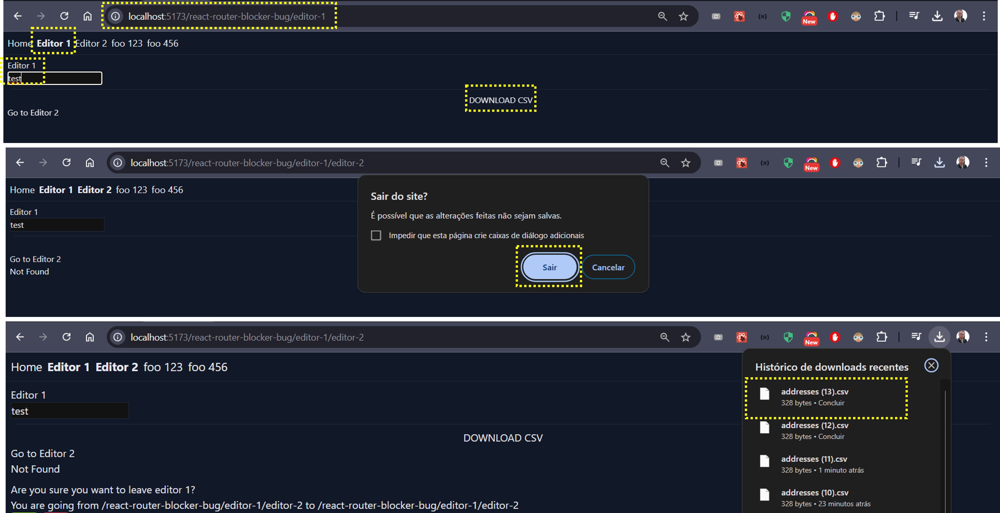

npm install

npm run dev

 - Go to "Editor 1" tab
 - write somethin in Editor 1 input
 - click in "DOWNLOAD CSV"
 - note that the shouldBlockFn is triggered - and the only way to download the CSV is clicking in "Leave", which is not at all intuitive for the user

 
